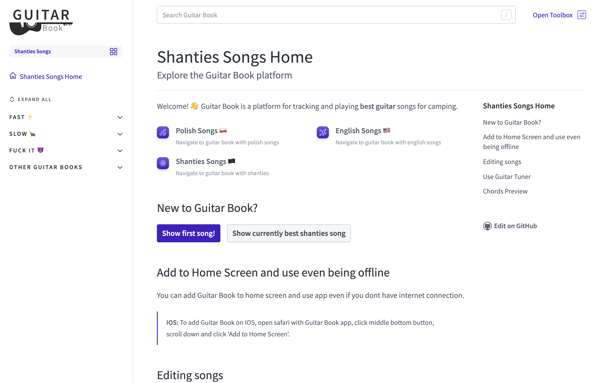
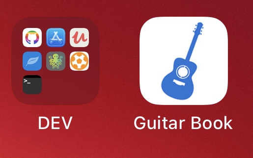

<div align="center">
  <a href="https://guitar-book-pjatk.netlify.app">
    
  </a>
  <hr/>
</div>


This is an entirely configuration-based Gatsby theme that generates a guitar book website based on a series of Markdown or MDX files.

- [Features](#features)
- [Published Demo Guitar Books](#published-demo-guitar-books)
- [Installation](#installation)
- [Configuration](#configuration)
- [Options](#options)
  - [`navConfig`](#navconfig)
- [Component shadowing](#component-shadowing)
- [Deployment](#deployment)

## Features

- Plug and Play
- Fully customizable
- Mobile, Tablet and Desktop friendly
- SEO friendly
- App works offline, and it can be added to phone/desktop home screen
- Free storing space for songs
- Easy to edit songs
- Editing songs without programming knowledge
- Integrated with Google Analytic and Ad Sense
- Lyrics Auto scroll
- Chords mapping and their preview with how to play them
- Music Video for every song with just link from YouTube
- Fully covered search

## Published Demo Guitar Books

| Module      | Status                                                                                                                                                                 | Public URL                             |
| ----------- | ---------------------------------------------------------------------------------------------------------------------------------------------------------------------- | -------------------------------------- |
| Example app | [](https://app.netlify.com/sites/guitar-book-pjatk/deploys) | https://guitar-book-pjatk.netlify.app/ |

<br/>
<br/>
<div align="center">
    
</div>
<br/>
<div align="center">
  
  &emsp;&emsp;&emsp;
  
</div>
<br/>
<br/>

## Installation

If you're using this package, you'll also need to install `gatsby` and its peer dependencies, `react` and `react-dom`. Next, install the theme:

```bash
npm install gatsby-theme-guitar-book
```

or

```bash
yarn add gatsby-theme-guitar-book
```

## Configuration

You can configure `gatsby-theme-guitar-book` for use with any set of app using the provided configuration options. You may also use [component shadowing](https://www.gatsbyjs.com/docs/themes/shadowing/) to customize elements like the logo or color scheme.

```js
// gatsby-config.js
module.exports = {
  pathPrefix: '/english',
  plugins: [
    {
      resolve: `gatsby-theme-guitar-book`,
      options: {
        contentfulAPIKey: 'ApiKey',
        contentfulSpaceId: 'spaceID',
        gaTrackingId: 'TrackingId',
      },
    },
  ],
};
```

> **Important note:** Remember that guitar book must always have at least one .md **and** mdx file to build successfully.

## Options

| Option name  | Type   | Required | Description                              |
| ------------ | ------ | -------- | ---------------------------------------- |
| gaTrackingId | string | No       | Your site's Google Analytics tracking ID |

### `navConfig`

The `navConfig` option should be an object keyed by link titles. The values should be objects with `description`, and `url` properties.

## Component shadowing

You can customize a website using this theme further by taking advantage of component shadowing.

```js
import React from 'react';
import { Helmet } from 'react-helmet';

export default function SEO({ title, description, siteName }) {
  return (
    <Helmet>
      <link rel="icon" href="/path/to/custom-favicon.ico" />
      {/* other SEO tags (OpenGraph, Twitter, etc.) */}
    </Helmet>
  );
}
```

## Deployment

All apps sites will eventually be deployed into a subdirectory, as configured by the `pathPrefix` option&mdash;/shanties, for example.
