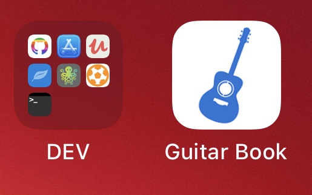

<div align="center">
  <a href="https://guitar-book.netlify.app">
    
  </a>
  <hr/>
</div>


This is an entirely configuration-based Gatsby theme that generates a guitar book website based on a series of Markdown or MDX files. 
It also exports a series of [components](#components) that can be used within MDX pages.

- [Published Demo Guitar Books](#published-demo-guitar-books)
- [Installation](#installation)
- [Configuration](#configuration)
- [Options](#options)
  - [`sidebarCategories`](#sidebarcategories)
  - [`navConfig`](#navconfig)
- [Adding songs](#addings-songs)
- [Component shadowing](#component-shadowing)
- [Components](#components)
  - [`Verse`](#verse)
  - [`ExpansionPanel`](#expansionpanel)
- [Deployment](#deployment)
- [Examples](#examples)
- [Template](#template)

## Published Demo Guitar Books

| Module   | Status | Public URL |
| -------- | --- | --- |
| Polish Songs | [](https://app.netlify.com/sites/guitar-book/deploys) | https://guitar-book.netlify.app/ |
| English Songs | [](https://app.netlify.com/sites/guitar-book-english/deploys) | https://guitar-book.netlify.app/english |
| Shanties Songs | [](https://app.netlify.com/sites/guitar-book-shanties/deploys) | https://guitar-book.netlify.app/shanties |

<br/>
<br/>
<div align="center">
    
</div>
<br/>
<div align="center">
  
  &emsp;&emsp;&emsp;
  
</div>
<br/>
<br/>

## Installation

If you're using this package, you'll also need to install `gatsby` and its peer dependencies, `react` and `react-dom`. Next, install the theme:

```bash
npm install gatsby-theme-guitar-book
```
or

```bash
yarn add gatsby-theme-guitar-book
```

## Configuration

You can configure `gatsby-theme-guitar-book` for use with any set of app using the provided configuration options. You may also use [component shadowing](https://www.gatsbyjs.com/docs/themes/shadowing/) to customize elements like the logo or color scheme.

```js
// gatsby-config.js
module.exports = {
  pathPrefix: '/english',
  plugins: [
    {
      resolve: `gatsby-theme-guitar-book`,
      options: {
        ...themeOptions,
        root: __dirname,
        baseDir: 'apps/english',
        subtitle: 'English Songs',
        siteName: 'Guitar Book',
        pageTitle: 'Guitar Book',
        description: 'Track and play best guitar songs for camping',
        githubRepo: 'jozwiaczek/guitar-book',
        menuTitle: 'Songs Types',
        gaTrackingId: 'UA-122299419-2',
        baseUrl: 'https://guitar-book.netlify.app/',
        logoLink: 'https://guitar-book.netlify.app//',
        contentDir: 'content',
        twitterHandle: 'jozwiaczek',
        youtubeUrl: 'https://www.youtube.com/c/JakubJ%C3%B3%C5%BAwiak/featured',
        navConfig: {
          'Polish Songs 🇵🇱': {
              url: 'https://guitar-book.netlify.app/',
              description:
                'Navigate to guitar book with polish songs'
            },
            'English Songs 🇺🇸': {
              url: 'https://guitar-book.netlify.app/english',
              description:
                'Navigate to guitar book with english songs'
            },
            'Shanties Songs 🏴‍': {
              url: 'https://guitar-book.netlify.app/shanties',
              description:
                "Navigate to guitar book with shanties"
            }
        },
        sidebarCategories: {
          null: ['index'],
          'George Ezra': [
            'blame-it-on-me',
            'listening-to-the-men'
          ],
          'Other Guitar Books': [
            '[Polish 🇵🇱](https://guitar-book.netlify.app)',
            '[Shanties 🏴‍](https://guitar-book.netlify.app/shanties)'
          ],
        }
      }
    }
  ]
};
```

> **Important note:** Remember that guitar book must always have at least one .md **and** mdx file to build successfully.

## Options

| Option name       | Type   | Required | Description                                                                                                                             |
| ----------------- | ------ | -------- | --------------------------------------------------------------------------------------------------------------------------------------- |
| root              | string | Yes      | Must be `__dirname`                                                                                                                     |
| siteName          | string | Yes      | The main title for the website, used in the `<title>` element and top left corner of the site                                           |
| description       | string | Yes      | The site description for SEO and social (FB, Twitter) tags                                                                              |
| sidebarCategories | object | Yes      | An object mapping categories to page paths (see [`sidebarCategories` reference](#sidebarcategories))                                    |
| subtitle          | string | No       | The page title that gets rendered above the sidebar navigation                                                                          |
| pageTitle         | string | No       | The string to be rendered in the page's `<title>` tag. If omitted, `siteName` will be used.                                             |
| baseDir           | string | No       | If your Gatsby site does not live in the root of your project directory/git repo, pass the subdirectory name here (`english`, for example) |
| contentDir        | string | No       | The directory where songs content exists (`content` by default)                                                                          |
| githubRepo        | string | No       | The owner and name of the content repository on GitHub                                                                                  |
| gaTrackingId      | string | No       | Your site's Google Analytics tracking ID                                                                                                |
| adSense           | string | No       | Your site's Google AdSense tracking ID                                                                                                |
| baseUrl           | string | No       | The origin where your website will be hosted (e.g. `https://guitar-book.netlify.app`)                                                     |
| twitterHandle     | string | No       | Your Twitter handle, without the "@"                                                                                                    |
| youtubeUrl        | string | No       | The URL of your YouTube channel                                                                                                         |
| navConfig         | object | No       | An object defining the top-left navigation links (see [`navConfig` reference](#navconfig))                                              |
| checkLinksOptions | object | No       | Options accepted by [`gastby-remark-check-links`](https://github.com/trevorblades/gatsby-remark-check-links#options)                    |
| ignore            | array  | No       | Files to ignore using [anymatch](https://github.com/es128/anymatch)-compatible definition pattern

### `sidebarCategories`

The `sidebarCategories` option is an object keyed by category titles. Each entry in the object is an array of page paths. The path should resemble the location of a Markdown/MDX file in the git repository, relative to `contentDir`, and without the _.md_ extension. Sidebar navigation items that are **not** a member of a category live under the `null` key. To add an external link to your sidebar, your can provide a string formatted like a Markdown link.

```
sidebarCategories: {
  null: ['index'],
  'George Ezra': [
    'blame-it-on-me',
    'listening-to-the-men'
  ],
  'Other Guitar Books': [
    '[Polish 🇵🇱](https://guitar-book.netlify.app)',
    '[Shanties 🏴‍](https://guitar-book.netlify.app/shanties)'
  ]
}
```

### `navConfig`

The `navConfig` option should be an object keyed by link titles. The values should be objects with `description`, and `url` properties. Check out the [default theme options](./gatsby-theme-guitar-book/theme-options.js) for an example of the expected shape of this data.

## Adding songs

This theme generates pages based on Markdown or MDX files in the [`contentDir`](#configuration) directory of a repo. Your Markdown/MDX files should contain some frontmatter defining their titles and descriptions.
To add new song use [Verse component](#verse) with .mdx file.

```mdx
---
title: Hallelujah
description: Jeff Buckley
ytLink: https://www.youtube.com/watch?v=y8AWFf7EAc4 
---

import { Verse } from 'gatsby-theme-guitar-book';

<Verse text={`
[Intro]
C Am C Am
\n
[Verse 1]
  C                 Am
I heard there was a secret chord
     C                   Am
That David played and it pleased the lord
    F                G               C        G
But you don't really care for music, do you?
        C                  F           G
Well it goes like this the fourth, the fifth
    Am                 F
The minor fall and the major lift
    G            E7             Am
The baffled king composing hallelujah
\n
[Chorus]
     F           Am          F           C    G   C
Hallelujah, hallelujah, hallelujah, hallelu-u-u-u-jah ....
`}/>
```

Page URLs will be derived from the file paths of your Markdown. You can nest Markdown files within directories to create pages with additional path segments. You can overwrite this default path by adding a `slug` field to your Markdown frontmatter header.

## Component shadowing

You can customize a website using this theme further by taking advantage of component shadowing.

```js
import React from 'react';
import {Helmet} from 'react-helmet';

export default function SEO({title, description, siteName}) {
  return (
    <Helmet>
      <link rel="icon" href="/path/to/custom-favicon.ico" />
      {/* other SEO tags (OpenGraph, Twitter, etc.) */}
    </Helmet>
  );
}
```

## Components

This theme exports React components that you can use in MDX files throughout a documentation website.

### `Verse`

This component gives you ability to show the lyrics with mapped preview of chords.

| Prop     | Type   | Description                                                                                                                                    |
| -------- | ------ | ---------------------------------------------------------------------------------------------------------------------------------------------- |
| text     | string | New lines in lyrics must be split by `\n`, other way you will get error. All chords should be placed on top of song line to be properly mapped |

```js
import { Verse } from 'gatsby-theme-guitar-book';

<Verse text={`
[Intro]
C Am C Am
\n
[Verse 1]
  C                 Am
I heard there was a secret chord
     C                   Am
That David played and it pleased the lord
    F                G               C        G
But you don't really care for music, do you?
        C                  F           G
Well it goes like this the fourth, the fifth
    Am                 F
The minor fall and the major lift
    G            E7             Am
The baffled king composing hallelujah
\n
[Chorus]
     F           Am          F           C    G   C
Hallelujah, hallelujah, hallelujah, hallelu-u-u-u-jah ....
`}/>
```

### `ExpansionPanel`

An expandable panel of content used to hide complex information or instructions that might be a tangent from the main topic of the content it lives within.

| Prop     | Type   | Description                                                        |
| -------- | ------ | ------------------------------------------------------------------ |
| children | node   | The content of the panel, usually includes an `ExpansionPanelList` |
| title    | string | The title of the panel, visible even when the panel is closed      |

## Deployment

All apps sites will eventually be deployed into a subdirectory, as configured by the `pathPrefix` option&mdash;/shanties, for example.

## Examples

In `apps` directory you will find my 3 connected guitar-books (english, polish, shanties).

## Template

If you want to start with your own guitar check `template` directory with [tutorial how to start](apps/template/README.md).  
